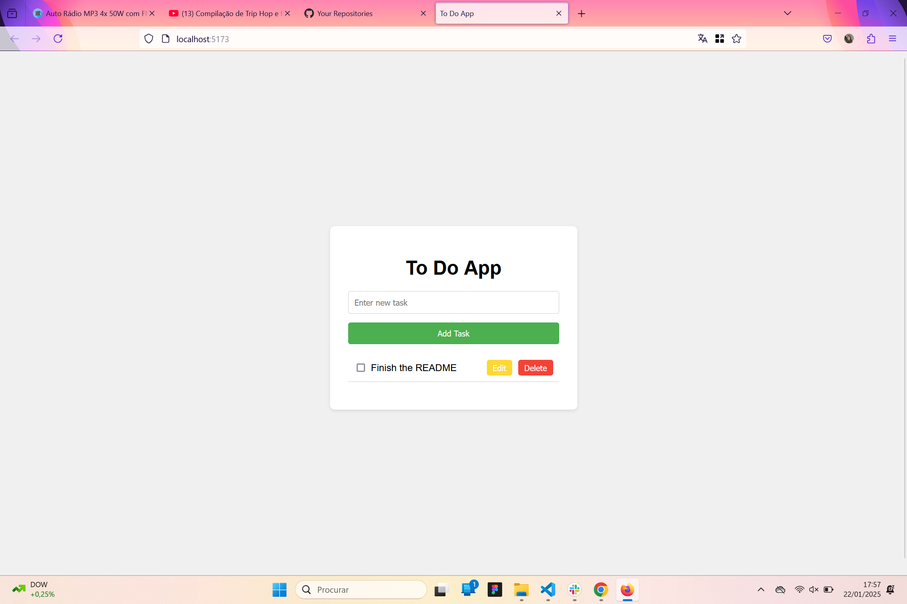
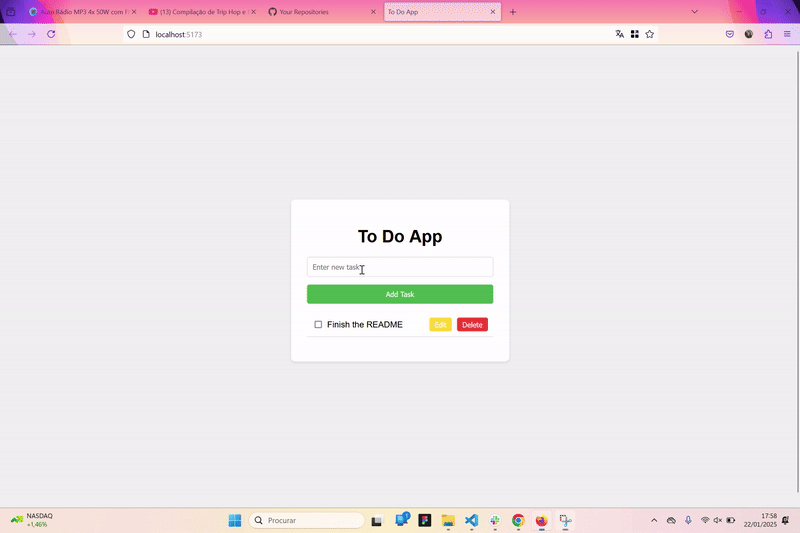

# To-Do List App

This project is a simple **To-Do List App** that allows users to add, edit, mark as complete, and delete tasks. It's built using **HTML**, **CSS**, and **JavaScript** with the help of **Vite** for rapid development.

## Features

- **Add Tasks:** Add new tasks to your to-do list.
- **Edit Tasks:** Edit existing tasks if needed.
- **Mark Tasks as Complete:** Mark tasks as done to keep track of your progress.
- **Delete Tasks:** Remove tasks from the list when they are completed or no longer necessary.
- **Filter Tasks:** Filter between all, completed, or pending tasks.
- **Responsive Design:** The app adjusts to different screen sizes, making it mobile-friendly.

## Technologies Used

- **HTML**: To structure the app's layout.
- **CSS**: To style the app and ensure it's visually appealing.
- **JavaScript**: For managing tasks and interactivity.
- **Vite**: For faster development and efficient module bundling.

## Screenshot



## GIF Demo

You can add a demo GIF of the app in action by replacing the placeholder with your actual GIF file:



## Installation

To get started, follow these steps:

1. Clone the repository:

   ```bash
   git clone https://github.com/suze8589/to-do-list-app.git
   ```

2. Navigate to the project directory:

   ```bash
   cd carousel-images
   ```

3. Install the dependencies:

   ```bash
   npm install
   ```

4. Run the development server:

   ```bash
   npm run dev
   ```

5. Open your browser and navigate to:
   ```
   http://localhost:5173
   ```

## Project Structure

```
to do list/
├── media/ # Folder for the images or GIFs
├── index.html # Main HTML file
├── styles.css # CSS file for styling
├── script.js # JavaScript file for functionality
├── vite.config.js # Vite configuration file
├── package.json # Project dependencies and scripts
└── README.md # Project documentation
```
